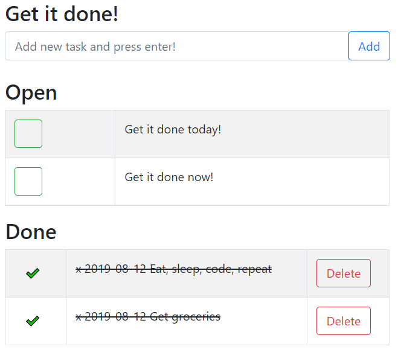

# gid - Get It Done! 
Simple self-contained and selfhosted todo or task manager.

This is really simple ToDo or task manager built with the latest jQuery and Bootstrap.

I was looking for a ToDo or task manager that was:
1. Self hosted 
2. Self contained
3. Uses a plaintext file
4. Mobile friendly
5. Able to track / see DONE items

Gid does just that:
1. Any PHP enabled webserver will do.
2. No need for third party tools, everything you need is here (Bootstrap and jQuery are included).
3. No database setup/connection necessary. Gid writes to a plaintext file that can be moved and editted by hand if needed.
4. Works nicely on iPhone
5. DONE items are still visible with a strikethrough.

Just drop/unpack the folder anywhere on your server and you're pretty much good to go (check your file ownership permissions).

Future features (maybe):
- Further todotxt.org file format support (Right now a done task will be written to a done.txt file with an 'x' and date).
